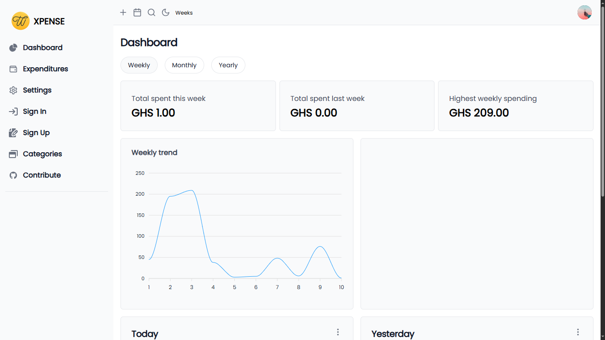

# XPENSE



XPENSE is a Django-based expense tracking application designed to help users manage and monitor their spending effectively. The application is currently under development and not yet ready for production use.

## 🚀 Live Website  

[Visit XPENSE](https://expense-tracking-application.onrender.com)  
*Note: The site may take some time to load as it is hosted on a free plan, and servers go idle when inactive.*

---

## 💻 Setup Guide  

Follow these steps to contribute to the project:

### 1. Fork and Clone the Repository  

Make a fork of the repository and clone it to your machine:

```bash
# Original Repository
https://github.com/wodoame/expense-tracking-application.git

# Your Fork
git clone https://github.com/<your_username>/expense-tracking-application.git
```

### 2. Set Up a Python Virtual Environment

Create and activate a virtual environment for the project:

```bash
# Create the virtual environment
python3 -m venv etavenv

# Activate it
# For Linux/Mac:
source etavenv/bin/activate

# For Windows:
etavenv\Scripts\activate
```

### 3. Install Dependencies

Install the required Python packages:

```bash
pip install -r requirements.txt

#Note: If you encounter issues with psycopg2, install psycopg2-binary instead
pip install psycopg2-binary
```

### 4. Configure Environment Variables

Create a .env file in the root directory and add the Django secret key:

```bash
cd expense-tracking-application
vi .env

#add the following line to the .env file
DJANGO_SECRET_KEY=your_secret_key_here
```

Save and exit the file.

📢 Tip: Contact the maintainers after forking the repo to get the secret key.

### 5. Apply Migrations

Run Django migrations to set up the SQLite database:

```bash
cd expense-tracking-application/expense-tracking-app
python manage.py migrate
```

### 6. Start the Development Server

Run the server to view and contribute to the application:

```bash
python manage.py runserver
```

### 7. Contribute

Make your changes or add a new feature.
Commit your updates and push them to your forked repository.
Create a pull request to the main repository for review.

```bash
git add .
git commit -m "Your descriptive commit message"
git push origin your-branch-name
```

Once your PR is reviewed, necessary steps will be taken to integrate your contributions. 🎉

## 🛠 Tech Stack

Backend: Django
Frontend: HTML, CSS, JavaScript
Database: SQLite3 (default for development)
Environment Configuration: python-decouple (via .env files)

## 📝 Notes

This project is in development and not production-ready.
For any issues or questions, feel free to open an [issue on GitHub](https://github.com/wodoame/expense-tracking-application/issues).
<!-- Please adhere to the Contribution Guidelines (if available)./ -->